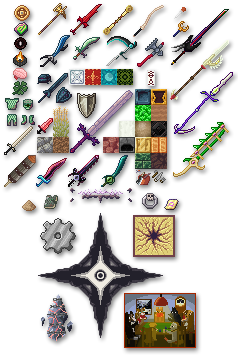

# Foreck's Textures

A collection of textures and models I've created over the past few years since I started working on the MC modpack Rebirth of the Night. All of these textures and models are available under a CC BY 4.0 license, meaning you are free to use them in your own mods, modpacks, or other projects.

This collection includes a fair amount of unique weapons, items and blocks. There are also non-standard textures used for custom models made with Blockbench for blocks and mobs. Most of these are used in Rebirth of the Night, but others are also used in published mods and modpacks alike, as well as some that are completely unused. The optifine folder has a few features like CTM gravel/sand/grass and custom "tapestry" blocks, you will have to change the block IDs in the .property files if you want them to apply to your own blocks (and you will need Optifine too, of course, although you are free to use them with the CTM mod or for anything else).

It is up to you to make models for the x32 and x64 textures to scale adequately, otherwise, they will just look like small overly HD weapons.

License: [CC-BY 4.0 License](https://creativecommons.org/licenses/by/4.0/)

If you like my work, consider buying me a coffee.   

My work is completely voluntary and I do not currently take comissions.
Current lead developer of Rebirth of the Night along with Sandwich Horror.  

Also check:
https://github.com/Kompreya/Kompy-Textures
https://github.com/malcolmriley/unused-textures
